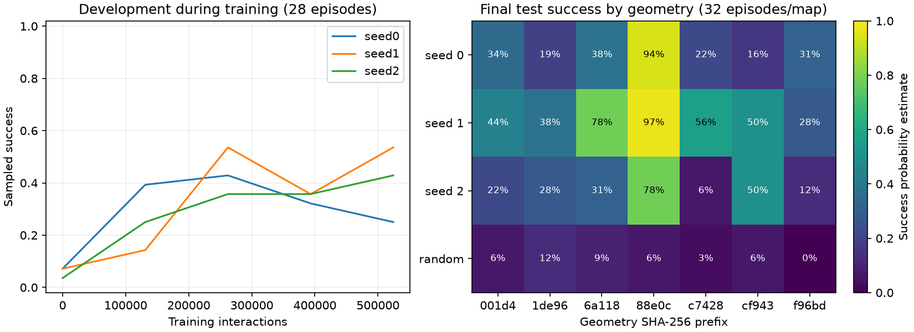

# Crossing baseline v1

PPO learns something useful, but still fails on many training maps. The current
baseline needs work before comparing representation-learning objectives.

Three seeds, 524,288 interactions each, using the
[settings fixed before training](../../protocols/crossing-v1.md). The environment is
MiniGrid SimpleCrossingS9N1: a wall with a gap, fixed start and goal. The MLP receives
the full symbolic grid. The 42 geometries are split 28/7/7 into train/development/test.

| Run | Train sampled | Dev sampled | Test sampled | Test greedy | Test sampled return |
|---|---:|---:|---:|---:|---:|
| crossing-v1-seed0 | 48.7% | 28.1% | 36.2% | 0.0% | 0.208 |
| crossing-v1-seed1 | 66.5% | 52.7% | 55.8% | 0.0% | 0.319 |
| crossing-v1-seed2 | 46.9% | 33.9% | 32.6% | 0.0% | 0.179 |
| random | 5.0% | 4.9% | 6.2% | — | 0.021 |

Scores use the final checkpoint and 32 sampled episodes per map, with equal weight
per map. Greedy execution needs only one episode per map here. There are seven test
geometries; repeated action samples do not make the test set larger. The random row
comes from one shared baseline evaluation.

Median train success is 48.7%. This did not clear the 80% threshold chosen before
training for deciding whether to proceed with a representation comparison. Next,
inspect failures and test the observation encoding; its role is still a hypothesis.

All three checkpoints were saved before test evaluation. The budget and settings
were unchanged. These test maps have now been inspected and should be treated as
exposed in follow-up work.

The curves use small intermediate evaluations before PPO updates. The table uses
the final saved models and a fresh action seed. Evaluation has its own RNGs. The
folders beside this report contain per-episode scores, configurations, source and
checkpoint hashes, and training diagnostics. Model files remain in local `runs/`.
