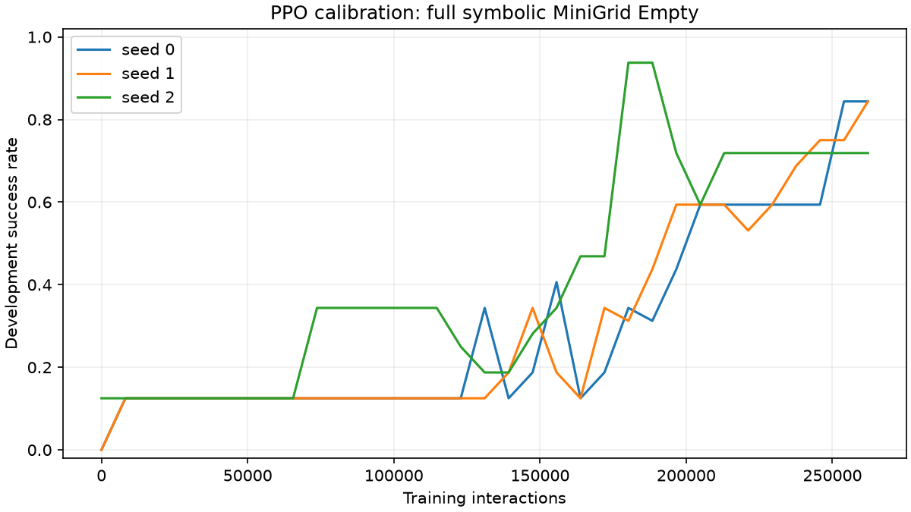

# First PPO calibration

This checks that the training loop learns in a small environment. It does not test JEPA,
world-model planning, transfer, or a novel method.

| Training seed | Interactions | PPO success | PPO return | Random success | Random return |
|---|---:|---:|---:|---:|---:|
| 0 | 262,144 | 84.4% | 0.806 | 65.6% | 0.378 |
| 1 | 262,144 | 93.8% | 0.902 | 65.6% | 0.378 |
| 2 | 262,144 | 71.9% | 0.693 | 65.6% | 0.378 |
| 0 | 32,768 | 9.4% | 0.092 | 65.6% | 0.378 |

Each final score uses 32 episodes with seeds 20,000–20,031 and the final checkpoint,
with deterministic PPO actions. Random actions use one fixed RNG stream, shared across
runs: its repeated score is one comparator, not independent baseline replications.
The layout and goal are fixed; starts vary. Different evaluation seeds do not guarantee
different states from training. These results establish neither generalization nor
statistical significance. No confidence interval is inferred from pooled training seeds.

The 32,768-interaction seed-0 pilot was inspected first. Its poor result motivated
increasing the budget to 262,144 and running seeds 0, 1, 2 from scratch with unchanged
hyperparameters. This was an adaptive calibration decision, not a preregistered test.
The small run and longer seed-0 run are not independent replications.

Development evaluation uses 32 fixed episodes with seeds 10,000–10,031. Periodic
callbacks evaluate at rollout boundaries before the following PPO update; the final
table evaluates the saved checkpoint after all updates. Training returns use sampled
actions and should not be equated with deterministic evaluation performance.

Per-run folders contain raw evaluation episodes, PPO diagnostics, configuration,
source hashes and checkpoint hashes. Checkpoints remain in the local `runs/` folders;
they can be regenerated with the README commands. No pretrained JEPA weights were used.

Next: inspect failed trajectories and establish adequate baseline coverage before moving
to a larger room or a predictive representation. Do not tune on these final episodes
and continue to call them an untouched test set.
