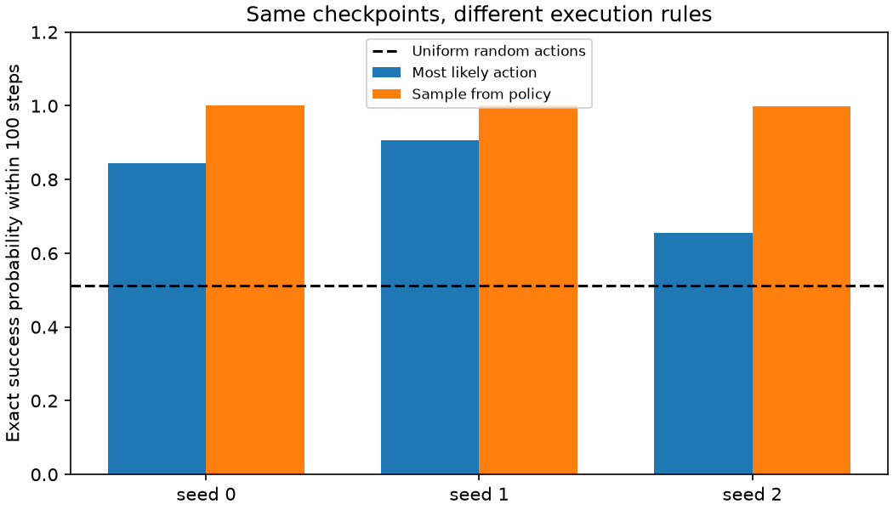

# Why some PPO evaluations failed

The saved policies perform well when actions are sampled from their learned distribution.
Taking only the most likely action creates deterministic cycles for some starts.
This is a behavioral diagnosis in one tiny room, not a new RL result or evidence about JEPA.

## Complete state coverage

The room has 8 non-goal starting cells and 4 headings: 32 valid initial states.
All 32 have distinct observations. We obtained all seven one-step transitions for each
state from the actual environment. For each checkpoint we extracted its categorical
action probabilities, then propagated probability mass for the native 100-step horizon.
This integrates action sampling exactly (up to floating-point error), rather than
estimating it from a small rollout sample. It assumes this deterministic room and a
stationary feed-forward policy; it is not an evaluator for arbitrary environments.

| Run | Greedy success | Sampled success | Greedy cycle failures / 32 | Sampled mean steps |
|---|---:|---:|---:|---:|
| empty-262k-seed0 | 84.375% | 99.99985% | 5 | 7.43 |
| empty-262k-seed1 | 90.625% | 99.99999% | 3 | 6.25 |
| empty-262k-seed2 | 65.625% | 99.98682% | 11 | 7.16 |

Uniform random actions achieve 51.309% exact success under the same
uniform weighting over starts. The old 65.6% random result was a finite rollout estimate
on a different weighted set of starts; it was not an exact baseline.

The previous development seeds covered 21/32
distinct states, and final seeds covered 20/32.
That explains why some scores change under complete coverage. This is a diagnostic
re-evaluation of previously inspected checkpoints, not a new held-out generalization test.

## A concrete failure

For seed 2, starting at (1,1) facing east, the greedy policy moves to (2,1), then (3,1),
then keeps trying to move into the east wall. At (3,1,east), forward has probability
0.658, while turning right has probability 0.338. Taking argmax always repeats
the wall collision. Sampling retains the chance of turning, so the state is not a trap.
All greedy failures in these checkpoints enter repeated position/heading cycles.

## Independent rollout check

We also executed 32 stochastic episodes per initial state
(1,024 per policy) using SB3's actual action sampler and the real environment, without
the probability-transition calculation. Seed 777 fixes action sampling. All three
trained policies succeeded in all these sampled episodes; this does not prove perfect
success, and the exact calculation above retains their small failure probabilities.

| Policy | Observed success | Exact expected return | Observed mean return |
|---|---:|---:|---:|
| empty-262k-seed0 | 100.000% | 0.9331 | 0.9335 |
| empty-262k-seed1 | 100.000% | 0.9437 | 0.9431 |
| empty-262k-seed2 | 100.000% | 0.9355 | 0.9338 |
| random | 51.074% | 0.3161 | 0.3168 |

## Decision

The sampled policy is an adequate calibration baseline on this room. Increasing the
training budget just to repair greedy execution is not the next priority. Keep both
execution rules visible in subsequent experiments and choose the primary rule before
comparing methods. PPO was trained with sampled actions; greedy execution is a separate
deployment choice, not a bug in the old evaluation.

This does not establish optimal paths, larger-room performance, visual learning, or
generalization. Before adding predictive pretraining, the next baseline needs a task
with meaningful variation and a fixed data/evaluation protocol. This small solved room
is useful for checks, but has little headroom for a representation-learning claim.

No policy was retrained in this audit. Existing checkpoints and their hashes are retained.
Tests cover closed-form absorption, distinct observations, shortest-path reachability,
and detection of a wall-collision cycle. Raw per-state probabilities, trajectories and
independent rollout episodes are included alongside this report.
